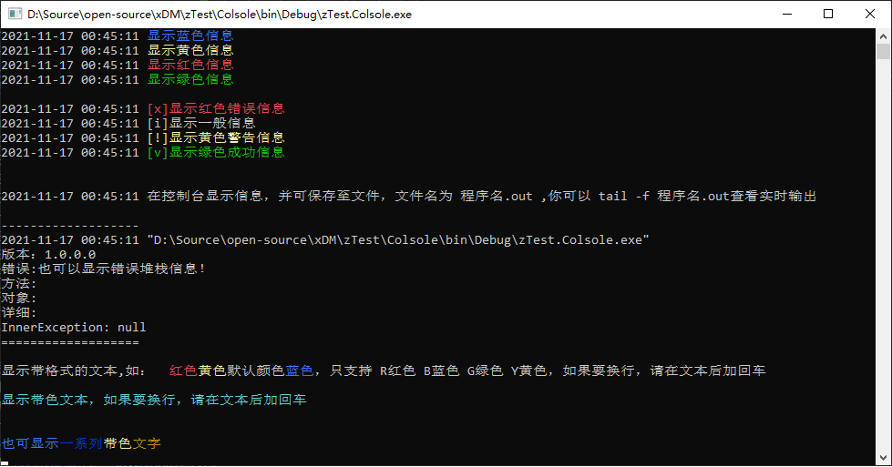

# xDM.xLog

## 日志相关操作，XLogger 可以实现保存日志到数据库、文件，并可定期自动清理日志文件，这个使用比较简单

### XLogger静态方法（显示即时输出）

#### XLogger 静态方法主要在控制台下显示一些个性化的东西，也可以把输出从终端变为文件，对一些没有界面的情况比较有用


```
    System.Console.WriteLine("测试 XLogger 的静态方法");
    System.Console.WriteLine();

    XLogger.ConsoleShowRed("开头带时间1");
    XLogger.ConsoleShowRed("开头带时间2", true);
    XLogger.ConsoleShowRed("开头不带时间", false);
    XLogger.ConsoleShowRed("开头带时间，时间带颜色", true, true);
    System.Console.WriteLine();

    XLogger.ConsoleShowBlue("显示蓝色信息");
    XLogger.ConsoleShowYellow("显示黄色信息");
    XLogger.ConsoleShowRed("显示红色信息");
    XLogger.ConsoleShowGreen("显示绿色信息");
    XLogger.ConsoleShowColor("显示你指定的颜色", ConsoleColor.Magenta);
    System.Console.WriteLine();

    XLogger.ConsoleShowError("显示红色错误信息");
    XLogger.ConsoleShowInfo("显示一般信息");
    XLogger.ConsoleShowWarning("显示黄色警告信息");
    XLogger.ConsoleShowSucess("显示绿色成功信息");
    System.Console.WriteLine();

    XLogger.ConsoleShowInfo("也可以显示错误堆栈信息");
    try
    {
        System.IO.File.ReadAllText($"不可能有这个文件吧.{Guid.NewGuid()}");
    }
    catch (Exception err)
    {
        XLogger.ConsoleShowError("这里模拟一个错误", err, ConsoleColor.Red);
    }
    System.Console.WriteLine();

    info = "显示带格式的文本,支持 <R>R红色</R> <B>B蓝色</B> <G>G绿色</G> <Y>Y黄色</Y>，如果要换行，请在文本后加回车\\n";
    System.Console.WriteLine(info);
    XLogger.ConsoleShowFormatText(info + "\n");
    XLogger.ConsoleShowInfo("如果要自动换行，请传入 linefeed = true 参数 ");
    XLogger.ConsoleShowFormatText(info, true);
    System.Console.WriteLine();

    var text = new XTextInfo();
    text.Color = ConsoleColor.Cyan;
    text.Text = "显示带色文本，如果要换行，请在文本后加回车\\n";
    XLogger.ConsoleShowText(text);
    XLogger.ConsoleShowInfo("如果要自动换行，请传入 linefeed = true 参数 ");
    XLogger.ConsoleShowText(text, true);
    System.Console.WriteLine();

    System.Console.WriteLine();
    var txtList = new List<XTextInfo>();
    txtList.Add(new XTextInfo() { Color = ConsoleColor.Blue, Text = "也可显示" });
    txtList.Add(new XTextInfo() { Color = ConsoleColor.DarkBlue, Text = "一系列" });
    txtList.Add(new XTextInfo() { Color = ConsoleColor.Yellow, Text = "带色" });
    txtList.Add(new XTextInfo() { Color = ConsoleColor.DarkMagenta, Text = "文字\n" });
    XLogger.ConsoleShowTexts(txtList);
    System.Console.WriteLine();

    System.Console.WriteLine("你现在可以打开程序所在目录看看 out 文件的内容");
    System.Console.WriteLine($"{MyAppInfo.AppPath}{MyAppInfo.AppName}.out");
    System.Console.WriteLine();

    XLogger.ConsoleShowSucess("静态方法测试完毕，静态方法还有其他功能，等你来发现！！");
    Console.Read();
```

#### 将你的Winform/Web程序变成也有控制台支出的程序
保存至文件，文件名为 程序名.out，IIS 网站为 网站根目录/AppData/web.out ,你可以 tail -f 程序名.out查看实时输出

##### 指定保存到 out 文件
```
    XLogger.ConsoleWriteLine("保存信息到 out 文件里", true);
    XLogger.ConsoleWriteLine("这句不显示", false);
```

##### 指定所有静态方法保存到 out 文件
```
    XLogger.AutoSaveToOutFile = true;
    XLogger.ConsoleShowSucess("如果设置静态变量 XLogger.AutoSaveToOutFile = true; 则所有输出都自动保存到输出文件，用于实时监控程序运行情况");
    XLogger.ConsoleShowSucess("之后所有没有指定 false 的静态方法的输出都保存到文件 程序名.out");
    XLogger.ConsoleWriteLine("不保存到文件要这样写", false);
```
### XLogger 对象方法，用于保存日志到文件，可以自动清除日志文件

#### 默认 logger
```
    //这里提供一个默认的 logger 
    var logger = XLogger.DefaultLogger;
    //剩下的就和自定义的一样，当然，你也可以修改默认 logger 的配置
    //默认配置为：
    /*
    var config = new XLogConfig();
    config.FILE_CheckSkipCount = 16;
    config.FILE_LogSavePath = "logs";
    //if 是IIS网站
    config.FILE_LogSavePath = "网站根目录/App_Data/Logs";
    */
```

#### 自定义配置的 logger
```
    var loggerConfig = new XLogConfig(); //获取一个日志配置，你可以使用 XConfigor 自动监听配置文件变化
    loggerConfig.FILE_CheckSkipCount = 16; //最近16条日志，如果重复则不保存
    loggerConfig.FILE_DeleteOldLogFileDays = 30; //删除超过30天旧日志
    loggerConfig.FILE_LogFileGroup = XLogFileGroup.None; //日志分组，可以配置每年、每月、每天、每小时一个文件夹或者不设置分组文件夹，一天一个文件。
    loggerConfig.FILE_LogSavePath = "logs"; //日志保存目录，默认为程序目录/logs
    loggerConfig.MsgStartWithTime = true; //自动在信息开头加上当前时间
    var xlogger = new XLogger(loggerConfig);

    var log = "我就是个日志";
    xlogger.SaveToFile(log);
    xlogger.SaveToFileAsync(log);

    log = "我就是个错误！";
    xlogger.SaveErrorToFile(log);
    xlogger.SaveErrorToFileAsync(log);

    try
    {
        System.IO.File.ReadAllText($"不可能有这个文件吧.{Guid.NewGuid()}");
    }
    catch (Exception err)
    {
        xlogger.SaveErrorToFile(log, err);
        xlogger.SaveErrorToFileAsync(log, err);
    }
```

### XLogger 保存日志到数据库，此功能要有实体类，数据库实体类参考DataClient
```
    var loggerConfig = new XLogConfig(); //获取一个日志配置，你可以使用 XConfigor 自动监听配置文件变化
    loggerConfig.DB_CacheFailDBLog = true;//数据库保存失败缓存至本地Sqlite
    loggerConfig.DB_DatabaseType = xDM.xData.DatabaseType.SQLServer;
    loggerConfig.DB_ConnectString = "连接字符串";
    var xlogger = new XLogger(loggerConfig);

    IXLogObj logObj = null; //你的对象
    xlogger.SaveToDB(logObj);
    xlogger.SaveToDBAsync(logObj);

    IXErrorLogObj errLogObj = null; //你的对象
    xlogger.SaveErrorToDB(errLogObj);
    xlogger.SaveErrorToDBAsync(errLogObj);
```

### XLogger 还有一种类似 Log4j/Log4Net 的用法，它可以自动获取当前的调用堆栈和其它信息，如在哪个方法里调用了日志记录

    